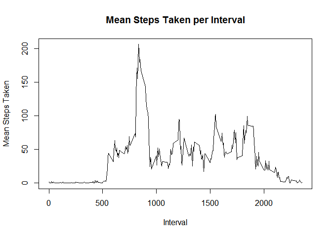

# Reproducible Research: Peer Assessment 1


## Loading and preprocessing the data
To load the data, we simply unzip the file and read it into a dataframe variable.
No preprocessing is necessary.

```r
unzip("activity.zip")
ds <- read.csv("activity.csv")
```


## What is the mean total number of steps taken per day?
Here we first calculate the total number of steps taken each day.
These totals are shown in the histogram:

```r
dailySteps <- tapply(ds$steps, ds$date, sum, na.rm = TRUE)
hist(dailySteps, main = "Steps Taken per Day", xlab = "Steps Taken")
```

<!-- -->

The mean and median are given by the following code:

```r
mean <- round(mean(dailySteps),2)
median <- median(dailySteps)
```

The mean daily total is 9354.23, and the median is 10395.


## What is the average daily activity pattern?
First we calculate the average number of steps for each five-minute interval, and plot it:


```r
intSteps <- tapply(ds$steps, ds$interval, mean, na.rm = TRUE)

plot(
  x = names(intSteps), 
  y = intSteps, 
  type = "l", 
  main = "Mean Steps Taken per Interval",
  xlab = "Interval",
  ylab = "Mean Steps Taken"
)
```

<!-- -->

The interval with the highest average number of steps is the one beginning at 
835.

## Imputing missing values
The total number of missing values is given by:

```r
sum(is.na(ds$steps))
```

```
## [1] 2304
```


We will fill in missing values with the average step count from the same interval, across
all days that have values there.

In order to do that, we first make a data frame out of the interval means data calculated above, and merge it with the main dataset.


```r
intdf <- data.frame(intSteps)
intdf$interval <- rownames(intdf)
compds <- merge(ds, intdf, by = "interval")
```

Next we overwrite the missing values with the corresponding interval means.

```r
compds[is.na(compds$steps),]$steps <- compds[is.na(compds$steps),]$intSteps
```

Finally, we calculate and plot the new daily totals:

```r
dailyStepsComp <- tapply(compds$steps, compds$date, sum)
hist(dailyStepsComp, main = "Steps Taken per Day", xlab = "Steps Taken")
```

<!-- -->

The new mean and median are:

```r
round(mean(dailyStepsComp),2)
```

```
## [1] 10766.19
```

```r
median(dailyStepsComp)
```

```
## [1] 10766.19
```

Note that these values are higher than those calculated in the first part of the assignment,
when missing values were ignored. The way the previous calculation was done, any day
that had some values but was missing others was likely to be undercounted. (Those missing values were essentially treated as zeroes.) This new method, where we've imputed the missing values, likely gives more realistic numbers.


## Are there differences in activity patterns between weekdays and weekends?
Here we will use the timeDate package to easily distinguish between weekdays and weekends:

```r
library(timeDate)
```

```
## Warning: package 'timeDate' was built under R version 3.3.2
```

```r
compds$wkday <- factor(
  isWeekday(compds$date), 
  levels = c(FALSE, TRUE), 
  labels = c("weekend","weekday")
)
```

Using the aggregate function, we get the mean for each combination of interval and weekday vs. weekend. That gives us a dataframe in which the Group.1 column is the interval, Group.2 is the weekday-weekend factor, and x is the mean number of steps. We use the ggplot2 function to easily produce a faceted plot.

```r
library(ggplot2)
agg <- aggregate(compds$steps, by = list(compds$interval, compds$wkday), FUN = "mean")
g <- ggplot(agg, aes(Group.1, x))
g + geom_line() + facet_grid(Group.2 ~ .)
```

<!-- -->

We can see that there are indeed some distinctions between the weekday and weekend patterns. Weekdays show a jump in activity before 6:00am, and then spike to over 225 steps per interval around 8:30am. On weekends, there is very little activity before 8:00am, and the peak is less than 175 steps per interval.
